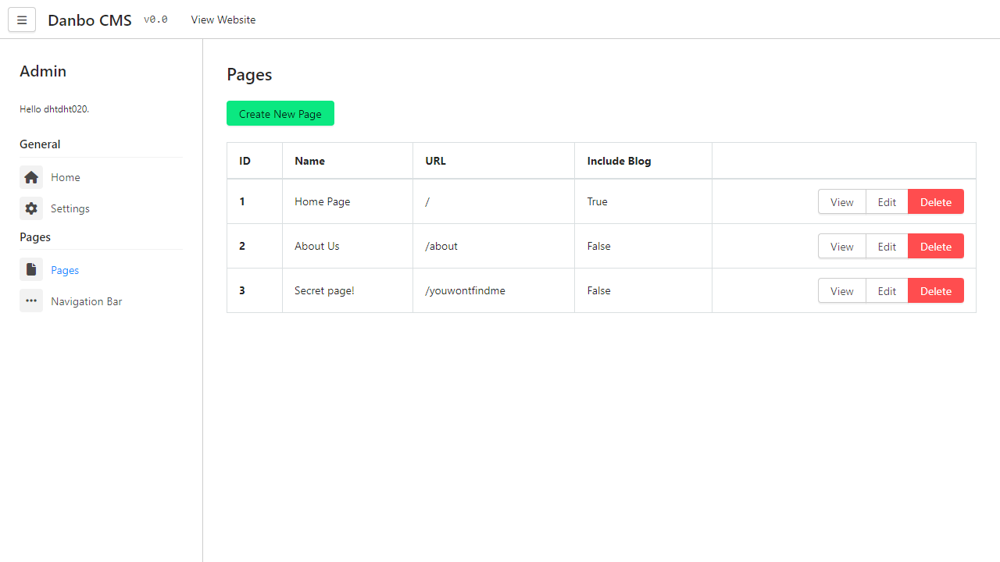
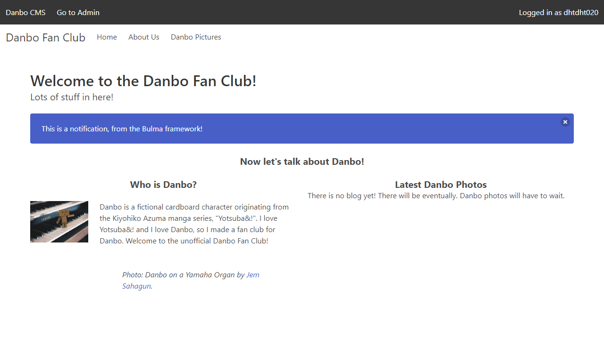

# DanboCMS
DanboCMS is a very early in-development Python and Flask-based content management system.

DanboCMS is a content management system that is designed to be easy to use and easy to configure.
It provides an administration panel that allows you to manage your content and a front-end interface that allows people to view that content.

At the current stage, DanboCMS is a work in progress and is not yet ready for production use.

The front-end interface uses the [Bulma](https://bulma.io/) framework, and the admin interface uses the [Halfmoon](https://www.gethalfmoon.com/) framework, both of which are
mobile-responsive.

## Admin Environment

## Front-end Environment
Create as many pages as you'd like! Customize the navigation bar!

The dark bar at the top of the page is only displayed to logged in administrators.

